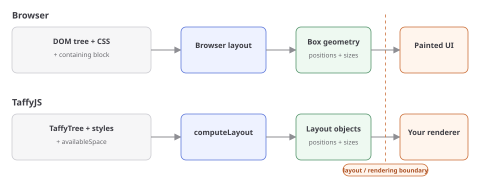

# Getting Started

If you have used CSS Flexbox, you already understand most of the layout in this example. The new part is making the inputs and the layout step explicit.

## Install

Install `@taffyjs/node` with npm:

```sh
npm install @taffyjs/node
```

`@taffyjs/node` requires Node.js 22.18 or newer.

## Start from CSS

Suppose this row lives in a containing block that is 100 pixels wide:

```html
<div class="row">
  <div class="item"></div>
  <div class="item"></div>
</div>
```

```css
.row {
  display: flex;
  width: 100%;
  height: 20px;
}

.item {
  flex-grow: 1;
}
```

You already know the result: the row is 100 pixels wide, each item receives half of that width, and the second item begins 50 pixels from the left.

The browser quietly supplies several pieces of the process. It gets a tree from the DOM, layout rules from CSS, and the outer constraint from the containing block. It runs layout when needed and later paints the boxes. TaffyJS asks you to provide the layout inputs directly.

## Express the same layout with TaffyJS

Create `layout.mjs`:

```ts
import { Dimension, Display, TaffyTree } from "@taffyjs/node";

const tree = new TaffyTree();

const first = tree.newLeaf({ flexGrow: 1 });
const second = tree.newLeaf({ flexGrow: 1 });

const root = tree.newWithChildren(
  {
    display: Display.Flex,
    size: { width: Dimension.Percent(100), height: 20 },
  },
  [first, second],
);

tree.computeLayout({
  root,
  availableSpace: { width: 100, height: 20 },
});

console.log(tree.getLayout(first).size);
console.log(tree.getLayout(second).location);
```

Run it with Node.js:

```sh
node layout.mjs
```

The output describes the same two boxes as the CSS example:

```text
{ width: 50, height: 20 }
{ x: 50, y: 0 }
```

The two programs express the same relationships. `newWithChildren` records the parent and its ordered children. `Display.Flex`, the percentage width, and `flexGrow` play the same roles as their CSS counterparts. `computeLayout` performs the layout step, and `getLayout` reads the resulting geometry.

<!-- When @taffyjs/wasm is available, replace the two static width runs with one in-page control that varies availableSpace.width while keeping the tree and styles unchanged. Keep the Node example above as the canonical code path. -->

## Change one input

Keep the tree and every style unchanged. Change only the available width from 100 to 300:

```ts
tree.computeLayout({
  root,
  availableSpace: { width: 300, height: 20 },
});

console.log(tree.getLayout(first).size);
console.log(tree.getLayout(second).location);
```

Now the output changes to:

```text
{ width: 150, height: 20 }
{ x: 150, y: 0 }
```

This is the same thing that happens when a CSS element with `width: 100%` moves into a wider containing block. The percentage belongs to the node's style; 300 is the outside space available for this particular layout. Keeping those two ideas separate is important because the same tree and styles can be computed under different constraints.

## Translate the browser model

The concepts line up, but TaffyJS makes the layout phase visible:

<div role="region" aria-label="Browser and TaffyJS layout process" tabindex="0" style="overflow-x: auto">
  
</div>

| In a browser                      | In TaffyJS                               |
| --------------------------------- | ---------------------------------------- |
| DOM nodes and their relationships | Nodes owned by a `TaffyTree`             |
| CSS layout declarations           | JavaScript style objects                 |
| The containing block              | `availableSpace` for the root            |
| The browser's layout phase        | An explicit `computeLayout` call         |
| Computed box geometry             | `Layout` objects returned by `getLayout` |

The analogy stops at rendering. TaffyJS does not parse HTML or CSS, create DOM elements, or paint pixels. Its concrete lengths are plain numbers rather than CSS `px` strings. It turns a tree, layout rules, and outside constraints into rectangles; your program decides what those rectangles mean on screen, on a canvas, in a document, or somewhere else.

That is the layout-engine model to carry forward: **tree + styles + available space → compute → rectangles**. [Essentials](./tree-compute-read.md) starts from the same model and examines each part in more detail.
