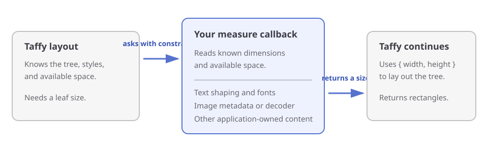

# Measuring Text and Images

Taffy lays out boxes. It does not shape letters, choose fonts, wrap strings, decode image files, inspect pixels, or render anything.

That distinction matters because text and images do not have a useful size by themselves. The size of text depends on its font, shaping, line breaks, and the width available for wrapping. An image's intrinsic size comes from decoded metadata. Your application already owns or chooses the systems that know those facts.

A measure callback connects those systems to Taffy. When Taffy needs the size of a leaf, it supplies the constraints it already knows. Your callback measures the content and returns a width and height. Taffy then continues laying out the surrounding boxes.

<div role="region" aria-label="How application content measurement connects to Taffy layout" tabindex="0" style="overflow-x: auto">
  
</div>

## Measure an image

Suppose an image decoder has already told your program that an image is 80 by 45 pixels. Store those intrinsic dimensions as node context, then use them when Taffy asks for a size:

```ts
import { AvailableSpace, TaffyTree, type MeasureFunction } from "@taffyjs/node";

type ImageContext = { intrinsicWidth: number; intrinsicHeight: number };

const tree = new TaffyTree<ImageContext>();
const image = tree.newLeafWithContext({}, { intrinsicWidth: 80, intrinsicHeight: 45 });

const measureImage: MeasureFunction<ImageContext> = ({ knownDimensions, context }) => {
  if (!context) throw new Error("Missing image dimensions");

  const { intrinsicWidth, intrinsicHeight } = context;
  const aspectRatio = intrinsicWidth / intrinsicHeight;
  const { width, height } = knownDimensions;

  if (width !== undefined && height !== undefined) return { width, height };
  if (width !== undefined) return { width, height: width / aspectRatio };
  if (height !== undefined) return { width: height * aspectRatio, height };
  return { width: intrinsicWidth, height: intrinsicHeight };
};

tree.setMeasure(image, measureImage);

tree.computeLayout({
  root: image,
  availableSpace: {
    width: AvailableSpace.MaxContent,
    height: AvailableSpace.MaxContent,
  },
});

console.log(tree.getUnroundedLayout(image).size); // { width: 80, height: 45 }
```

The image file is not itself a box size. The decoder supplies the intrinsic dimensions, the callback adapts them to Taffy's current constraints, and Taffy decides where the resulting box belongs.

Context is a convenient place to keep per-node measurement data, but it is not what makes a leaf measurable. `setMeasure` does that independently. A measured leaf created with `newLeaf` has `context === undefined`; its callback can instead use the `node` ID to look up data held elsewhere in your application. Conversely, a leaf can have context without a measure function and remain entirely in native layout.

Use `setMeasure(node, undefined)` to restore ordinary leaf sizing. `remove(node)` releases that node's callback, and `clear()` releases all callbacks in the tree.

## Text follows the same boundary

Text measurement is not the number of characters multiplied by a constant. A text system must choose the font, shape the glyphs, find legal line breaks, and account for the width available for wrapping. Taffy does none of that work.

Your callback passes Taffy's constraints to the text system you use and returns its measured size. The exact mapping depends on that system, but the inputs have stable meanings:

- `knownDimensions` contains a number for an axis Taffy has already fixed. The callback should preserve it.
- A definite `availableSpace.width` tells the text system how much horizontal space is available.
- `AvailableSpace.MaxContent` usually asks for the preferred width without optional wrapping.
- `AvailableSpace.MinContent` usually asks for the smallest width allowed by the text system's break opportunities.

Those last two rules are not a built-in text algorithm. Your application decides how its text library interprets minimum-content and maximum-content measurement.

## What the callback receives

The callback receives five values:

- `knownDimensions` contains the axes Taffy has already fixed.
- `availableSpace` contains `AvailableSpace.Definite(value)`, `AvailableSpace.MinContent`, or `AvailableSpace.MaxContent` for each axis.
- `node` identifies the leaf being measured.
- `context` is the exact JavaScript value stored for that node, or `undefined` when absent.
- `getStyle()` creates and returns a fresh, complete, normalized, detached style snapshot when style affects the measurement. Leave it uncalled when the content measurement does not need style.

Return a complete `{ width, height }` record. The callback is synchronous; returning a Promise or an incomplete record throws `TypeError`.

`getStyle()` replaces the earlier eager `style` callback field. The change is breaking, but avoids constructing a large JavaScript `Style` object for callbacks that only need constraints or context.

## Taffy may ask more than once

Taffy decides whether measurement is needed, how many times it is needed, and in which order nodes are visited. It may ask again with different constraints, or reuse a cached result without calling the callback at all. Do not depend on one call per node or a particular traversal order.

Replacing context with `setNodeContext` marks the node dirty. Mutating a stored context object in place does not, because the tree cannot observe that mutation. The same applies to values captured by the callback. Mark each affected node before computing again:

```ts
const imageData = tree.getNodeContext(image);

if (imageData) {
  imageData.intrinsicWidth = 120;
  tree.markDirty(image);
}
```

Calling `setMeasure` sets, replaces, or clears a per-node callback and marks the node dirty, even if the same function is supplied again. If only the callback's captured data changes, call `markDirty` yourself.

## Use a global fallback when every leaf is eligible

`computeLayout({ root, availableSpace, measure })` accepts an optional escape-hatch fallback for any leaf without a per-node callback. A callback configured with `setMeasure` takes priority. Code that only uses this global fallback keeps the previous behavior, but ordinary applications should register the nodes that actually own externally measured content.

Fallback identity and presence are not part of Taffy's cache key. When you add, remove, or change a fallback or its captured data, call `markDirty` on every leaf that may be affected. Marking only the compute root does not clear cached descendant measurements.

## Measurement runs during layout

The callback runs synchronously as part of layout computation. Treat it as a size calculation: read the supplied values, ask the relevant text or image system, and return dimensions. Calling native-backed methods on the same tree during the callback is not allowed.

The [`@taffyjs/node` computation reference](../node/computing-layout.md) documents the exact callback restrictions and cache behavior. [Errors](../node/errors.md) describes what happens when measurement throws or returns an invalid result.
